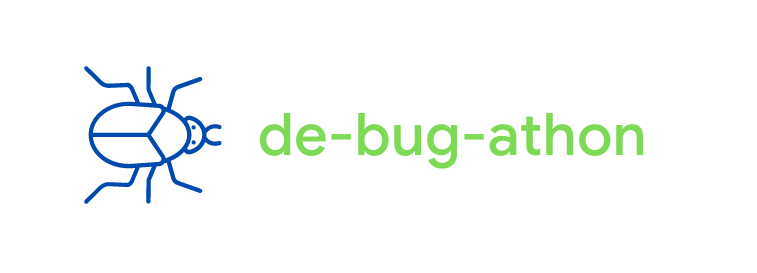

The motive of de-bug-athon is to get the rightly deserving candidates in a hiring process, because `if you can resolve a bug, you can do anything` :name_badge:

This awesome project will be deployed soon :)

## :star: Contributions

This is an open-source project, feel free to enhance the same by your valuable contributions. Make sure to follow the [open-source contribution guidelines](https://opensource.guide/how-to-contribute/).

## :star: Setup

In order to setup the project locally, follow the steps:

1. [Fork on GitHub](https://github.com/abhinavsri360/debugathon/fork)
2. Clone the forked repository.
3. `de-bug-athon` has the frontend :eyes:
4. `de-bug-athon_server` has the backend :smirk:

## :star: Backend setup

1. Create an account [here](https://www.jdoodle.com/)
2. Move to your creds [here](https://www.jdoodle.com/compiler-api) :closed_lock_with_key:
3. `cd de-bug-athon_server` from the root folder of this clone repository.
4. Rename `.example.nodemon.json` to `nodemon.json`
5. Enter your `CLIENT_ID` and `CLIENT_SECRET` into the file renamed above from the `creds` page of `jdoodle`.
6. Enter your `MONGO_URI` as well to connect the server to the database.
7. `npm i` or `yarn install` to install the dependencies involved in the project. [P.S. - I prefer `yarn`]
8. `npm start` or `yarn start` to run the project in development mode.
9. You can find the postman documentation [here](https://documenter.getpostman.com/view/11578947/Tzz7QJTR)
10. You would also need to setup your database, i.e., add 2 collections namely `users` and `codes`
11. Example data can be found inside `Sample Data` as `users.json` and `codes.json`

## :star: Frontend setup

1. cd `de-bug-athon`
2. Rename `.example.env` to `.env` for less painful time :stuck_out_tongue:
3. Update `src/shared/baseUrl.js` with the url where your backend is running. [by default this is localhost]
4. `npm i` or `yarn install` to install the dependencies involved in the project. [P.S. - I prefer `yarn`]
5. `npm start` or `yarn start` to run the project in development mode.

(: The setup is done! Happy coding!

 

